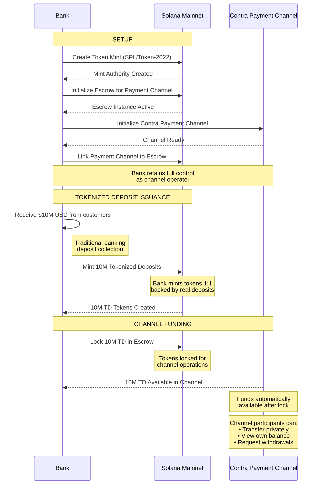
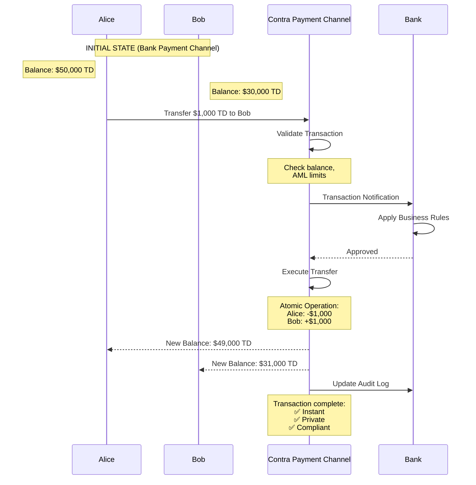
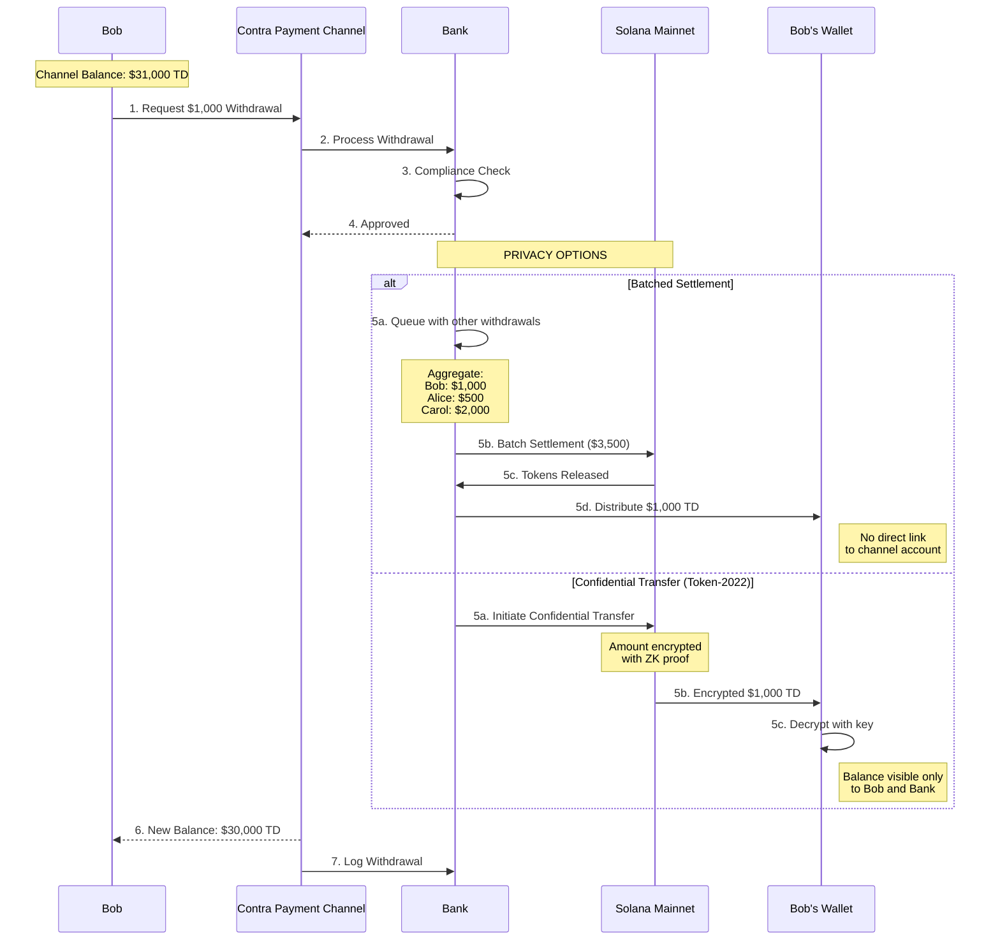

<div align="center">
  <br />
  
  <br />
  <br />

  <h3>Contra: Enterprise Infrastructure for Internet Capital Markets</h3>

  <br />

[](LICENSE)
</div>

Contra is a payment channel with direct access to Solana Mainnet liquidity. Contra provides a complete infrastructure solution to execute thousands of transactions instantly with privacy, control and permissioning, while assets are readily accessible to and from Solana Mainnet.

> ## ⚠️ SECURITY NOTICE
>
> **This code has not been audited and is under active development. Use at your own risk.**
>
> Not recommended for production use with real funds without a thorough security review. The authors and contributors are not responsible for any loss of funds or damages resulting from the use of this library.

---

## Documentation

- **[All Documentation](docs/README.md)** — Architecture, program references, guides, and operational requirements

## How Contra Works

Contra operates as a payment channel with direct access to Solana Mainnet liquidity:

- **Contra Channel**: Your private transaction batching system with direct Solana Mainnet access. Execute transactions with instant finality and full control over who participates and what rules apply.
- **Contra Escrow Program**: Makes assets readily accessible to the payment channel. Users deposit SPL tokens. The program locks funds in escrow for use within the channel.
- **Contra Withdrawal Program**: Withdrawals are initiated by sending tokens to the withdraw program inside the payment channel. The withdraw program burns the tokens and SPL tokens are released from the escrow program.
- **Contra Indexer/Operator**: Monitors deposits and withdrawals, orchestrates state synchronization, and maintains an auditable record of all activity.
- **Contra Auth**: Optional authentication service. Issues signed JWTs for registered users and verified Solana wallets. When enabled, the gateway enforces RBAC — restricting account queries to wallets the caller owns and reserving operator-only methods (block/transaction fetching, transaction simulation) for elevated accounts.

### Case Study - Payments

#### 1. Tokenized Deposit Issuance Flow

This flow shows how a bank creates a token mint and issues tokenized deposits on Solana mainnet, initializes a Contra payment channel for transactions between bank customers [Alice and Bob].



#### 2. Payment Transfer Flow (Within Channel)

This flow demonstrates a simple $1,000 transfer between bank customers Alice and Bob within the payment channel, showing how privacy is maintained while the bank retains control.



#### 3. Withdrawal Flow - Privacy Preserving Options

This flow shows how Bob withdraws $1,000 from the payment channel, subject to the bank's compliance policies and approval.

The flow shows two withdrawal methods that allow Bob to withdraw while preserving privacy.



### Transaction Processing Pipeline

Within the payment channel, transactions are processed through a **five-stage pipeline** for near-instant finality:

1. **Dedup**: Filters duplicate transactions using a blockhash-keyed signature cache
2. **SigVerify**: Parallelizes Ed25519 signature verification across configurable workers
3. **Sequencer**: Builds a DAG of account dependencies to produce conflict-free batches
4. **Executor**: Runs batches with custom execution callbacks:
   - **AdminVM**: Bypasses bytecode execution for privileged mint operations
   - **GaslessCallback**: Synthesizes fee payer accounts on-demand (zero operational overhead)
5. **Settler**: Batches results every 100ms and commits to PostgreSQL/Redis with atomic writes

### Contra Escrow/Withdrawal Programs

- **Contra Escrow Program**: Mainnet token custody with SMT security (Program ID: `GokvZqD2yP696rzNBNbQvcZ4VsLW7jNvFXU1kW9m7k83`)
- **Contra Withdrawal Program**: Channel withdrawal processing (token burning) (Program ID: `J231K9UEpS4y4KAPwGc4gsMNCjKFRMYcQBcjVW7vBhVi`)

### Indexer

The indexer monitors Solana Mainnet and your payment channel for deposits and withdrawals. It supports **two datasource strategies**:

1. **RPC Polling**: Fetches blocks sequentially via `getBlock` RPC calls
2. **Yellowstone gRPC**: Real-time block streaming via gRPC (Yellowstone protocol)

Both strategies parse Escrow/Withdraw Program instructions and write to PostgreSQL. The indexer automatically **backfills missing slots** on restart using parallel RPC batch fetching. An Operator service monitors new transactions in the database to trigger new mints in the channel or withdrawals back to Mainnet, ensuring synchronization.

## Quick Start

Get Contra running locally in under 5 minutes:

```bash
# Clone repository
git clone https://github.com/solana-foundation/contra.git
cd contra

# Install dependencies
make install

# Build all components
make build

# Test all components
make all-test
```

## Local Development

### Prerequisites

- [**Rust**](https://rust-lang.org/tools/install/): 1.75+ (stable)
- [**Solana CLI**](https://solana.com/docs/intro/installation): 2.2.19 (for programs), 2.3.9 (for using Yellowstone)
- [**Docker**](https://docs.docker.com/get-docker/): 26.0+ with Docker Compose
- [**pnpm**](https://pnpm.io/installation): 10.0+ (for TypeScript clients)

### Repository Structure

| Component | Path | Description |
|-----------|------|-------------|
| **Contra Core** | [core/](core/) | Payment channel transaction pipeline |
| **Contra DB** | [core/src/accounts/](core/src/accounts/) | Accounts database with multi-backend support |
| **Gateway** | [gateway/](gateway/) | Read/write node routing service with optional RBAC enforcement |
| **Auth** | [auth/](auth/) | Authentication service — user registration, login, wallet verification, JWT issuance |
| **Escrow Program** | [contra-escrow-program/](contra-escrow-program/) | Mainnet token deposit via escrow |
| **Withdrawal Program** | [contra-withdraw-program/](contra-withdraw-program/) | Channel token withdrawal via burning |
| **Indexer + Operator** | [indexer/](indexer/) | Mainnet & channel transaction monitoring & automation |
| **Integration Tests** | [integration/](integration/) | Cross-workspace integration tests |
| **Deployment** | [docker-compose.yml](docker-compose.yml) | Full stack deployment configuration |

### Install Dependencies

```bash
make install
```

### Build All Programs

```bash
make build
```

### Run Tests

```bash
# Run all tests (unit + integration)
make all-test

# Run unit tests only
make unit-test

# Run integration tests only
make integration-test
```

### Running with Auth (RBAC)

Auth is opt-in. The gateway runs without it by default — all RPC methods are accessible without a token.

To enable auth, set `JWT_SECRET` in your `.env` and start with the `auth` profile:

```bash
# Copy and configure env
cp .env.example .env
# Set JWT_SECRET=<your-secret> in .env

# Start full stack including auth service
docker compose --profile auth up
```

Once running, the auth service is available at `http://localhost:${AUTH_PORT}` (default `8903`). See [auth/README.md](auth/README.md) for the full API reference, role definitions, and wallet verification flow.

## Pinned tooling versions

CI pins the following tool versions. Local development environments should
match these to keep coverage reports and test behavior reproducible between
CI and local runs.

| Tool             | Version    | Install command                                        |
|------------------|------------|--------------------------------------------------------|
| Rust toolchain   | `1.91.0`   | Pinned in `rust-toolchain.toml` — `rustup` picks it up automatically |
| cargo-llvm-cov   | `0.8.4`    | `cargo install cargo-llvm-cov@0.8.4`                   |
| cargo-nextest    | `0.9.130`  | `cargo install cargo-nextest@0.9.130 --locked`         |
| Solana CLI       | `2.2.19`   | `sh -c "$(curl -sSfL https://release.anza.xyz/v2.2.19/install)"` |
| Node.js          | `22.x`     | See your distro's package manager                      |
| pnpm             | `10.15.1`  | `npm install -g pnpm@10.15.1` (also pinned via `packageManager` in each `package.json`) |

Container images used by integration tests (pulled automatically by
`testcontainers` at test time):

| Image                | Notes                                          |
|----------------------|------------------------------------------------|
| `postgres:11-alpine` | Default of `testcontainers-modules 0.13`.      |
| `redis:7`            | Warmed in CI before each integration run.      |

Source of truth for tool versions:
- Rust + `cargo-llvm-cov` + pnpm: [`.github/actions/setup-environment/action.yml`](.github/actions/setup-environment/action.yml)
- `cargo-nextest`: [`.github/workflows/rust.yml`](.github/workflows/rust.yml) (`Install cargo-nextest` step)
- Solana CLI: [`.github/actions/setup-solana/action.yml`](.github/actions/setup-solana/action.yml)
- pnpm (also): `packageManager` field in `contra-escrow-program/package.json`

When bumping any version, update the CI config **and** this section in the
same PR so the two stay in sync.

## License

This project is licensed under the MIT License. See [LICENSE](LICENSE) for details.

## Acknowledgments

Built with:
- [Agave](https://github.com/anza-xyz/agave) - Solana Validator Client
- [Yellowstone gRPC](https://github.com/rpcpool/yellowstone-grpc) - Real-time Geyser streaming
- [Pinocchio](https://github.com/anza-xyz/pinocchio) - Efficient Solana program SDK

